# SafetyNevi (안전네비)

재난문자를 지도 위 위험 구역으로 바꾸고, 현재 위치에서 운영 중인 가장 가까운 대피소까지 경로를 안내하는 재난 대피 웹 서비스입니다. 인하공업전문대학 졸업작품으로 만들었습니다.

- 개발 기간: 2025.08.31 ~ 2025.12.14
- 평가 운영: 2025.12.07 ~ 12.14, `safety.inhatc.com` (현재 데모 서버는 내린 상태)
- 구성: 메인 서버(Spring Boot) + AI 서버(Python FastAPI), 팀 4명

재난문자는 텍스트라 "내 주변이 위험한지, 어디로 가야 하는지"가 한눈에 들어오지 않습니다. 그래서 공식 재난문자를 지도 위 위험 구역(폴리곤)으로 그리고, 지금 운영 중인 대피소까지의 경로를 안내하도록 만들었습니다. 졸업작품 데모에서 멈추지 않고, 같은 학기 안에서 실제 운영을 가정해 공식 API 전환, 인프라(Redis·Kafka), CI/CD, 보안, AI 재설계까지 이어서 보강했습니다.

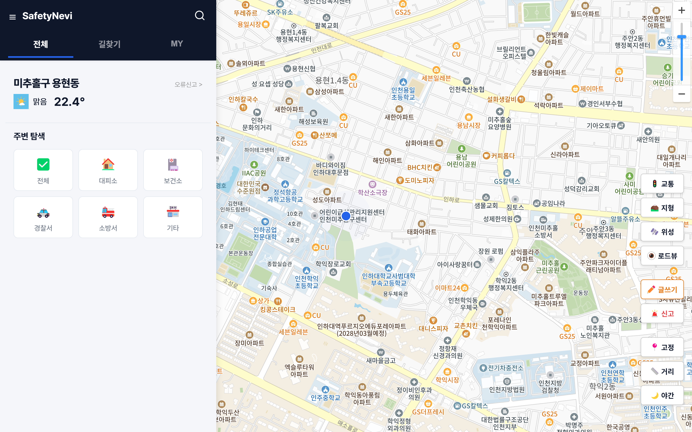

> 위험도 AI는 한계가 분명합니다(아래 9번). 안전 판단의 최종 근거가 아니라, 공식 경보를 빠르게 지도에 띄우고 대피를 돕는 보조 도구로 봐주세요.

## 목차

- [1. 개요](#1-개요)
- [2. 팀](#2-팀)
- [3. 배포 인프라 구성](#3-배포-인프라-구성)
- [4. 주요 기능](#4-주요-기능)
- [5. AI 파이프라인](#5-ai-파이프라인)
- [6. 데모를 넘어서](#6-데모를-넘어서)
- [7. 설계 다이어그램](#7-설계-다이어그램)
- [8. 기술 스택](#8-기술-스택)
- [9. 한계와 트레이드오프](#9-한계와-트레이드오프)
- [10. 디렉터리 구조](#10-디렉터리-구조)
- [11. 설치 및 실행](#11-설치-및-실행)

---

## 1. 개요

기후변화와 도시화로 재난은 잦아지는데, 재난문자는 텍스트라 "내 주변이 위험한지, 어디로 가야 하는지"가 직관적이지 않습니다. SafetyNevi는 재난문자를 지도 위 위험 구역으로 바꾸고, 현재 위치에서 운영 중인 대피소까지 경로를 안내합니다.

```
재난문자 / 기상 데이터  ->  분류(재난유형) · 공식 긴급단계  ->  지도 폴리곤 + WebSocket 실시간 알림  ->  운영 중 대피소 경로 안내
```

메인 서버(Spring Boot)와 AI 서버(Python FastAPI)를 분리해, 무거운 텍스트 추론이 웹 응답을 막지 않도록 했습니다. 전국 경찰·소방·병원·대피소 수천 건을 기동 시 적재해 지도에 클러스터링으로 띄웁니다.

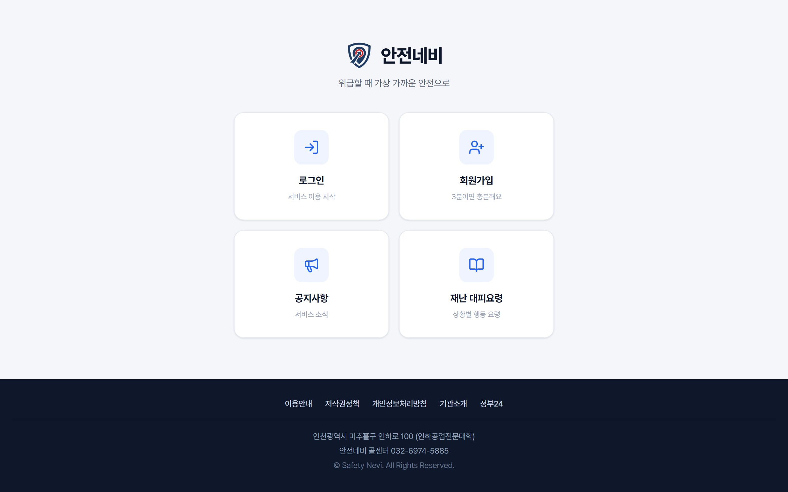

---

## 2. 팀

| 이름 | 포지션 | 주요 기여 |
| :--- | :--- | :--- |
| [이상혁](https://github.com/SanghyeokLee-KR) | Tech Lead · PM | Python AI 서버·모델, 지도 핵심(폴리곤·경로 탐색)·WebSocket, Oracle 스키마·관리자, 배포(Docker·Nginx/HTTPS) |
| 유기민 | Backend | 재난문자 수집 스케줄러, 게시판·공지·문의 REST API, DB 스키마 |
| 김보겸 | Frontend Lead | 전체 퍼블리싱·반응형, 로고·아이콘·발표자료, 회원 UX |
| 이진혁 | Frontend | 재난 행동요령 콘텐츠, 테스트 데이터셋 |

실서비스를 지향한 보강(공식 API 전환·Redis/Kafka·CI/CD·관측·보안·AI 재설계)은 이상혁이 맡았습니다.

---

### 내 기여

이 저장소의 첫 커밋 [`9cc3daf`](https://github.com/SanghyeokLee-KR/SafetyNevi/commit/9cc3daf)는 팀 졸업작품 결과물 241파일 49,226줄을 한 번에 올린 것입니다. 팀 원본과 제 작업의 경계가 그 커밋에 묻혀 있으므로, 그 이후 이력을 기준으로 적습니다.

개발 기간은 `9cc3daf`(2025-09-01)부터 [`c2ebcbf`](https://github.com/SanghyeokLee-KR/SafetyNevi/commit/c2ebcbf)(2025-12-14)까지입니다. 아래 값은 그 구간을 양끝으로 못 박은 것이라 이후 커밋이 쌓여도 변하지 않습니다.

| 항목 | 값 | 확인 방법 |
| :--- | :--- | :--- |
| 커밋 | 153건 전부 단독 | `git log --oneline 9cc3daf..c2ebcbf \| wc -l` |
| 수정한 파일 | 384개 | `git log 9cc3daf..c2ebcbf --name-only --pretty=format: \| sort -u \| grep -c .` |
| 새로 만든 파일 | 183개 | `git log 9cc3daf..c2ebcbf --diff-filter=A --name-only --pretty=format: \| sort -u \| grep -c .` |
| 활동일 | 105일 | `git log 9cc3daf..c2ebcbf --date=short --format=%ad \| sort -u \| wc -l` |

`c2ebcbf` 이후 커밋은 2026년에 붙인 정비분입니다. 인가 누락과 예외 매핑 교정, 부하 시나리오 추가, CI 연결이고 개발 기간 수치에는 넣지 않았습니다.

담당 경로는 `src/main/java`(백엔드·보안·관리자), `python`(AI 서버와 모델), `frontend/src/map`(지도·경로 탐색), 그리고 배포 구성입니다.

대표 작업 세 건입니다.

- [`234f92f`](https://github.com/SanghyeokLee-KR/SafetyNevi/commit/234f92f) 실시간 재난문자 피드를 Kafka fan-out으로 바꿔 인스턴스가 여러 대여도 알림이 한 번만 나가게 했습니다.
- [`87bf2a6`](https://github.com/SanghyeokLee-KR/SafetyNevi/commit/87bf2a6) 웹푸시 구독 endpoint를 검증해 내부망 SSRF를 차단하고 지역값을 정규화했습니다.
- [`d1410eb`](https://github.com/SanghyeokLee-KR/SafetyNevi/commit/d1410eb) 미접속 사용자에게도 재난 알림이 가도록 표준 VAPID 웹푸시를 붙였습니다.

### 부하로 병목을 찾고 고친 것

공개 읽기 경로에 k6로 60 VU까지 걸어 어디서 무너지는지 봤습니다. 병목은 쿼리가 아니라
응답 크기였습니다. 시설 영역 조회가 한 번에 387KB를 내려보내며 이 경로 하나가 초당
52MB 전송을 만들고 있었습니다.

응답 바이트를 필드별로 쪼개 보니 주소가 25.2%였습니다. 그런데 마커를 찍는 화면 코드는
주소를 쓰지 않고, 주소는 상세 조회가 따로 내려줍니다. 목록 전용 DTO를 만들어 주소를 빼고
응답 압축을 켰습니다.

| 항목 | 고치기 전 | 고친 뒤 |
| :--- | ---: | ---: |
| 시설 조회 응답 | 387,454 B | 55,441 B |
| 시설 조회 p95 | 568.63ms | 215.54ms |
| 처리량 | 346.85 req/s | 579.44 req/s |
| 초당 전송량 | 37 MB/s | 9.9 MB/s |

측정 과정과 세 판의 원본 수치는 [`scripts/load/README.md`](scripts/load/README.md)에
있습니다. 측정하면서 시나리오 자체의 결함도 하나 찾았습니다. k6는 `Accept-Encoding`을
자동으로 붙이지 않아, 그대로 두면 서버 압축을 켜도 압축된 응답을 한 번도 받지 않습니다.


## 3. 배포 인프라 구성

AWS EC2 한 대에 Docker Compose로 배포합니다. GitHub Actions가 이미지를 빌드·테스트해 GHCR에 올리면, 서버가 받아서(`docker compose pull`) 교체합니다.

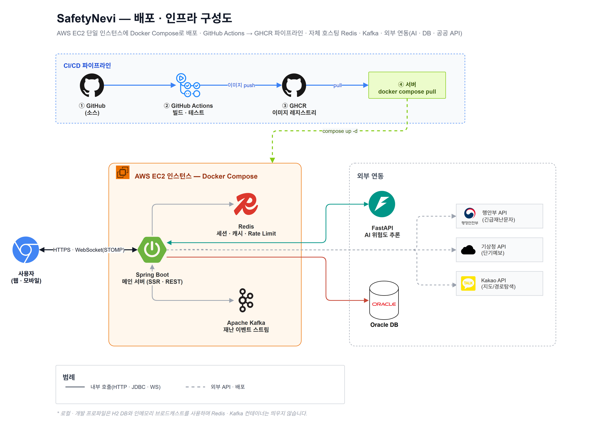

- CI/CD: push → GitHub Actions(빌드·테스트) → 이미지 GHCR push → 서버 SSH 접속 후 `docker compose pull` & 재시작. 비밀값은 이미지에 넣지 않고 서버의 `application-prod.properties`를 마운트합니다.
- 런타임(EC2 · Docker Compose): Spring Boot(SSR·REST), Redis(세션·캐시·Rate Limit), Kafka(재난 이벤트 스트림)를 한 인스턴스에 함께 띄웁니다.
- 외부 연동: FastAPI(AI 위험도 추론, HTTP), Oracle(운영 DB), 공공 API(행안부 긴급재난문자·기상청 단기예보·Kakao 지도/길찾기).
- 로컬·개발 프로파일은 H2 + 인메모리 브로드캐스트라 Redis·Kafka 없이도 바로 뜹니다.

---

## 4. 주요 기능

1. 실시간 긴급 알림 + GIS 시각화
   공식 긴급단계가 위급·긴급이면 WebSocket으로 접속 중인 모든 사용자에게 모달 알림을 보내고, 해당 지역을 지도에 붉은 폴리곤(위험 구역)으로 그립니다.

2. 위험구역을 피한 대피소 경로 안내
   단순 최단거리가 아니라 지금 운영 중인 시설만 추리고, 재난이 있으면 위험구역 안에 든 대피소는 빼고 안전한 쪽을 우선합니다. Kakao Mobility API로 실제 도로 경로와 소요시간을 계산하고, 그 경로가 위험구역을 지나면 경고를 띄웁니다.

3. 시설물 클러스터링
   전국 경찰서·소방서·병원·대피소 수천 개를 마커 클러스터링으로 묶어 보여줍니다. 화면에 보이는 범위만 조회하도록 박스 쿼리에 상한을 둬서 시설 조회를 1.8s 에서 0.27s (약 6.6배)로 줄였습니다.

4. 미접속 사용자 웹푸시 + 실시간 재난문자 피드
   WebSocket은 페이지가 열려 있을 때만 닿아서, 브라우저를 닫아도 받도록 표준 Web Push(VAPID, Firebase 없이)로 긴급재난을 푸시합니다. 구독할 때 관심 시/도를 골라 그 지역 재난만 받을 수 있고, 지도 사이드바엔 최신 재난문자가 실시간 피드로 흐릅니다. 인근에 재난이 생기면 거리 기준으로 비상 배너가 떠 대피 경로로 바로 연결됩니다.

5. 위치 기반 안전 커뮤니티 · 관리자 콘솔
   지도에서 직접 위치를 찍어 제보 글을 쓰고 댓글·좋아요로 공유합니다. 관리자는 재난 발령·회원·게시물·신고·문의를 한곳에서 관리하고, 재난 시뮬레이션 발령 전에 영향 대피소·구독자 수를 미리 봅니다. 시설·지역에 붙이는 QR을 만들어, 스캔만으로 앱 설치·로그인 없이 그 지역 재난 알림을 구독하게 할 수 있습니다.

재난 경보가 인스턴스 여러 대에서도 빠짐없이 가도록, Kafka 컨슈머 그룹을 인스턴스마다 고유(UUID)하게 둬서 모든 인스턴스가 모든 이벤트를 받아 각자 붙은 WebSocket 클라이언트로 fan-out 합니다.

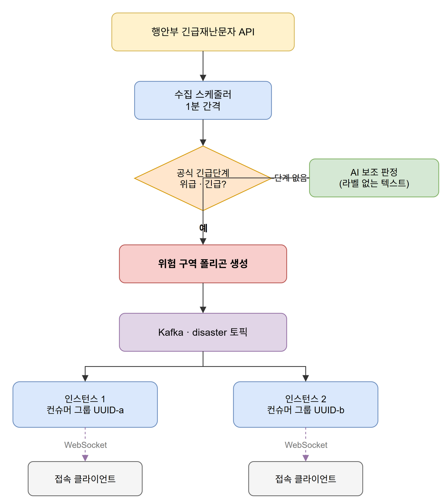

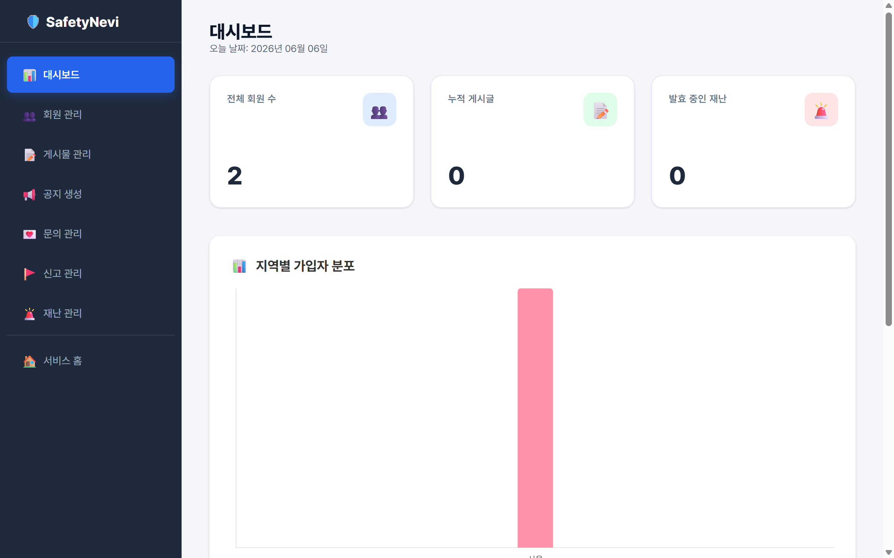

---

## 5. AI 파이프라인

위험도는 AI 추정이 아니라 정부 공식 긴급단계(위급·긴급·안전안내)를 그대로 중계합니다. 권위 있는 출처가 이미 분류해 준 값을 쓰는 게 맞다고 봤습니다. AI는 공식 단계가 없는 텍스트(시민 제보 등) 보조에만 씁니다.

| 단계 | 내용 |
| :--- | :--- |
| 수집 | 공식 API(행안부 긴급재난문자), 종류 · 긴급단계 · 내용 · 지역 |
| 위험 판정 | 공식 긴급단계가 위급·긴급이면 지역 기준 60분 위험 폴리곤 + WebSocket 전파. 안전안내는 표시만 |
| AI 보조 | 긴급단계가 비어 있는 메시지·시민 제보 텍스트만 scikit-learn으로 보조 추정 |

모델은 행안부 공식 재난문자 18,399건(2023.9 ~ 2024.8)으로 학습했습니다. 라벨이 본문 키워드가 아니라 공식 분류라서, "텍스트 → 공식 판정"을 배우는 지도학습입니다.

### 데이터

| | |
| :---: | :---: |
| 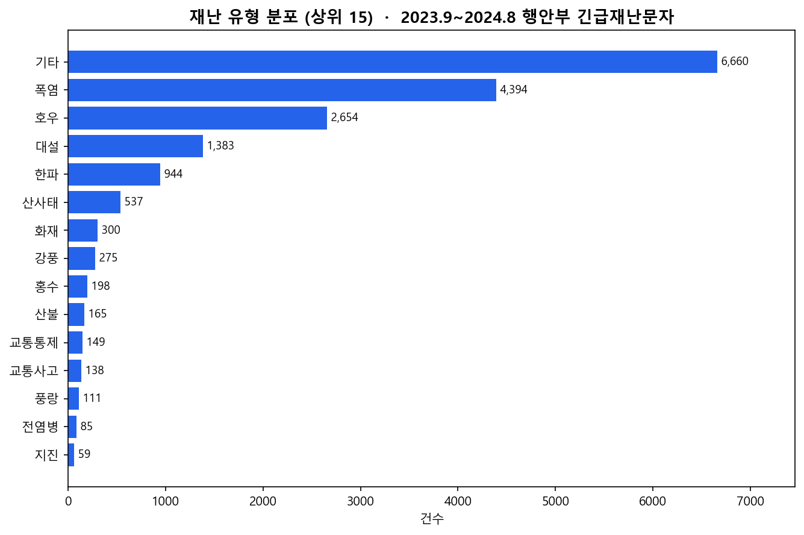 |  |

폭염·호우·대설 등 기상 재난이 대부분이고, 전염병은 85건(0.5%)에 불과합니다.

### 문제: 극단적 불균형

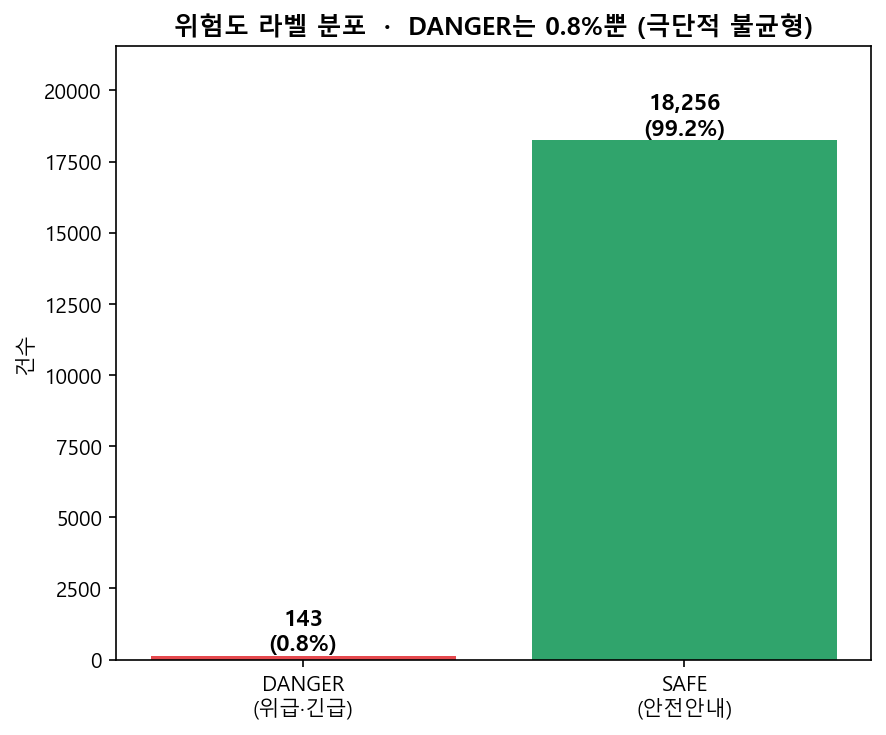

위험(DANGER)은 전체의 0.8%(143건)뿐입니다. 그냥 학습하면 전부 SAFE로 찍어도 99% 정확도가 나오는 함정이 있어서, 위험도 모델은 업샘플 대신 클래스 가중치(`class_weight='balanced'`)로 불균형을 처리했습니다.

### 모델과 성능

- 재난 종류: TF-IDF + MultinomialNB, 정확도 78%
- 위험도: TF-IDF + LogisticRegression(`class_weight='balanced'`)

| | |
| :---: | :---: |
| 재난 종류 · 클래스별 F1 | 위험도 · 혼동행렬 |
| 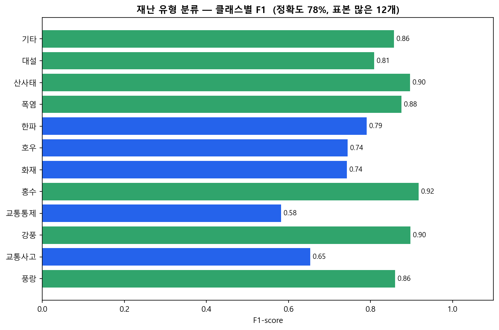 | 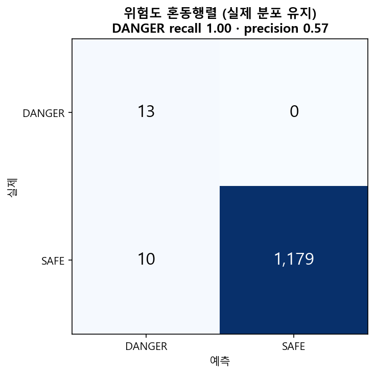 |

위험도 모델은 실제 긴급·위급을 거의 놓치지 않는 대신(recall 1.00), 과경보(precision 0.57)가 있습니다. 재난 안전에서는 "놓치느니 과경보"가 합리적인 편향이라 보고 recall을 우선했습니다.

혼동행렬의 표본은 1,202건입니다. 전체 18,399건의 20%가 아닙니다. 위험도 모델은 공식 긴급단계가 채워진 메시지만 쓰므로, 그 부분집합 6,010건에서 20%를 뗀 값입니다. 나머지는 긴급단계가 비어 있어 위험도 학습에 쓸 정답이 없습니다. 두 숫자를 나란히 보면 어긋나 보여서 적어 둡니다.

평가는 누수가 없도록 신경 썼습니다. 처음엔 위험도 정확도가 99%로 나왔는데, 소수 클래스를 업샘플한 뒤에 학습/평가를 나눠 같은 데이터가 양쪽에 새던 누수였습니다. 데이터를 먼저 나눈 다음 학습셋만 가중하도록 고쳐 실제 분포로 측정했고, 종류 모델도 증강본을 원본과 같은 그룹으로 묶어 평가했습니다. 위험도 라벨도 원래는 본문 키워드 규칙으로 만들어서 모델이 그 규칙을 그대로 모사하는 순환 구조였는데, 정부 공식 긴급단계를 정답으로 쓰도록 바꿔 비순환으로 만들었습니다.

---

## 6. 데모를 넘어서

졸업작품은 동작하는 데모였습니다. 같은 학기 안에서 실제 운영을 가정해 다음을 보강했습니다.

| 영역 | 한 일 | 왜 |
| :--- | :--- | :--- |
| 데이터 소스 | 네이버 HTML 크롤링에서 공식 OpenAPI(행안부 재난문자·기상청 단기예보)로 전환 | 크롤링은 페이지 구조가 바뀌면 깨지고 비공식. 공식 API가 안정적이고 합법 |
| 캐시 · 세션 · 레이트리밋 | 운영은 Redis, 로컬은 인메모리, 프로파일로 분리 | 인스턴스를 늘려도 캐시·세션·남용카운터가 공유돼야 함. 로컬은 Docker 없이 떠야 해서 갈라둠 |
| 이벤트 전파 | 재난 알림을 Kafka로 발행·소비, 컨슈머 그룹을 인스턴스마다 고유(UUID)하게 | 인스턴스가 여러 대면 모두가 각자 붙은 WebSocket 클라이언트로 fan-out 해야 알림이 다 감 |
| 배포(CI/CD) | GitHub Actions → Docker 이미지 빌드 → GHCR push → 서버 pull·재시작 | 푸시하면 테스트·이미지·배포까지 자동. 서버 시크릿이 없으면 배포 단계는 건너뜀 |
| 관측 | Actuator health / liveness / readiness + Prometheus 메트릭 | 로드밸런서·모니터링이 앱 상태를 읽을 수 있게 |
| 보안 | 보안 헤더 + CSP, IP 레이트리밋, 출력 escape(XSS), CSRF, 구독 endpoint SSRF 가드, graceful shutdown | XSS·API 남용·내부망 요청 방어, 배포 중 처리 중이던 요청 유실 방지 |
| 접근성 | 키보드 조작, 스크린리더 안내(aria-live), 색 대비를 점검(Lighthouse 접근성 100) | 안전 정보는 누구나 읽을 수 있어야 함 |
| 테스트 | 단위·슬라이스 테스트(보안 규칙·권한·입력검증·동시성·경로 안전) | 보안·정합성 수정마다 회귀 방지 |
| 프론트 빌드 | 중복 JS 정리 후 TypeScript(tsc) + Gradle 빌드 통합 | 타입 안전 + 빌드 산출물 일원화(`frontend/src` → `static/js` 자동 컴파일) |

운영 인프라(Redis·Kafka)는 `prod` 프로파일에서만 켜집니다. 로컬(`h2`)·테스트는 관련 오토컨피그를 빼서 Docker 없이 동작합니다(운영 검증 상태는 9번 참고).

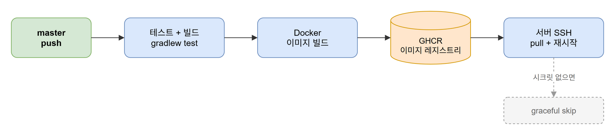

---

## 7. 설계 다이어그램

이미지를 누르면 원본 크기로 열립니다.

| | |
| :---: | :---: |
| 시스템 구성(캡스톤 설계 원안) | 유스케이스 |
| [](src/main/resources/static/img/다이어그램/시스템%20아키텍처.png) | [](src/main/resources/static/img/다이어그램/유스케이스%20다이어그램.png) |
| 클래스 | 데이터베이스 ERD |
| [](src/main/resources/static/img/다이어그램/클래스%20다이어그램.png) | [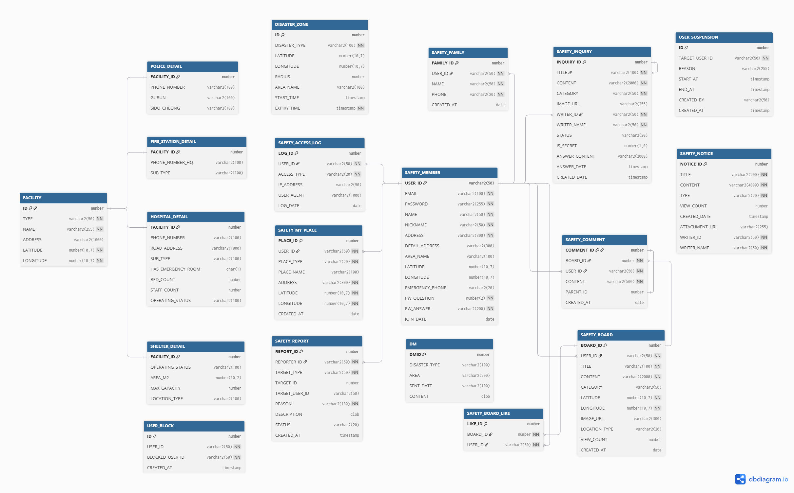](src/main/resources/static/img/다이어그램/erd다이어그램.png) |

---

## 8. 기술 스택

| 분류 | 스택 |
| :--- | :--- |
| Backend | Java 21, Spring Boot 3.5, Spring Security, JPA, WebSocket(STOMP) |
| AI 서버 | Python, FastAPI, scikit-learn, Pandas, Joblib |
| Frontend | TypeScript, Thymeleaf, HTML/CSS, Kakao Map/Mobility |
| 운영 인프라 | Redis(캐시·세션·레이트리밋), Kafka(이벤트), Docker, Nginx |
| DB | Oracle(운영) / H2(로컬·테스트) |
| CI/CD · 관측 | GitHub Actions, GHCR, Actuator, Prometheus |
| 외부 API | 행안부 긴급재난문자, 기상청 단기예보, Kakao |

---

## 9. 한계와 트레이드오프

실서비스 기준으로 남은 한계를 솔직하게 적습니다.

- 위험도 AI는 희귀 격상 탐지기에 가깝습니다. 공식 위급·긴급 격상이 워낙 드물어(0.8%) 모델을 recall에 치우치게 학습했습니다. 실제 긴급은 거의 다 잡지만 과경보(precision 0.57)가 있고, 표본 자체가 적어 일반화에는 한계가 있습니다. 그래서 위험 판정의 1차 근거는 항상 공식 긴급단계이고 AI는 보조입니다.
- 운영 인프라(Redis·Kafka)는 코드·설정까지 했지만 실부하 검증 전입니다. 프로파일 분리·`docker-compose`·fan-out 컨슈머 설계는 끝났지만, 실제 다중 인스턴스·부하·장애 검증은 아직입니다(로컬에 Docker가 없어 운영 런타임은 CI·서버 몫). 운영해 본 건 단일 인스턴스뿐입니다.
- 재난문자가 분 단위 실시간은 아닙니다. 행안부 공유 API(무료)는 오래된순 정렬이라 마지막 페이지부터 최신을 수집하는데, 데이터 자체가 보통 며칠 지연돼 들어옵니다. 진짜 실시간은 별도 수집 채널이 필요합니다. 원형 재난의 웹푸시 발송과 지역 구독도 시/도 단위라, 더 세밀한 타게팅은 추가 작업이 필요합니다.
- 데모 종료. 평가 운영 후 서버는 내렸습니다. 재배포하려면 서버·GitHub 시크릿 세팅이 필요합니다.

---

## 10. 디렉터리 구조

```
SafetyNevi/
├── src/main/java/.../safetynevi/   # Spring Boot, 도메인별 controller·service·dto·entity·config
├── src/main/resources/
│   ├── templates/                  # Thymeleaf 뷰
│   └── static/{css,js,img}         # 정적 리소스 (js 는 TypeScript 빌드 산출물)
├── frontend/src/                   # TypeScript 소스 (→ static/js 로 컴파일)
├── python/                         # FastAPI AI 서버 (main.py · train.py · visualize.py · *.pkl)
├── Dockerfile · docker-compose.yml # 이미지 빌드 + Redis/Kafka 포함 배포 구성
├── .github/workflows/ci.yml        # CI/CD (테스트 → 이미지 → GHCR → 배포)
└── build.gradle
```

---

## 11. 설치 및 실행

### 1) Python AI 서버

```bash
cd python
pip install fastapi uvicorn scikit-learn pandas joblib
uvicorn main:app --host 0.0.0.0 --port 8000
```

재난문자 CSV로 모델을 새로 학습하려면 `python train.py "<csv경로>"`, 학습 결과 시각화는 `python visualize.py "<csv경로>"` 입니다.

### 2) 메인 서버(Spring Boot), 요구사항: Java 21

로컬은 H2 인메모리로 Oracle·Docker 없이 바로 뜹니다. 별도 설정 없이 아래 한 줄이면 됩니다.

```bash
./gradlew bootRun --args='--spring.profiles.active=h2'
```

H2 프로파일 설정은 `src/main/resources/application-h2.properties`에 포함돼 있습니다. 비밀값이 없어 저장소에 그대로 두었고, 외부 API 키는 비어 있어 날씨·지도·재난문자 수집만 비활성 상태로 뜹니다.

Oracle로 붙이려면 실제 키가 든 설정을 따로 만듭니다. 이 파일은 git에 넣지 않습니다.

```bash
cp src/main/resources/application-example.properties src/main/resources/application.properties
# Kakao · 기상청 · 재난문자 API 키, DB 접속 정보 입력
./gradlew bootRun
```

- 접속: `http://localhost:9090`
- 테스트 계정: `admin / admin1234`(관리자), `test / test1234`(일반), 기동 시 자동 생성
- 프론트엔드는 자동 빌드됩니다. TypeScript(`frontend/src/*.ts`)가 `bootRun`·`build` 때 `static/js`로 컴파일됩니다(Node는 최초 1회 자동 다운로드).

### 3) 운영 배포(참고)

`docker-compose.yml`이 GHCR 이미지 + Redis + Kafka를 함께 띄웁니다. 서버에 Docker와 `application-prod.properties`(실제 키)를 두고:

```bash
docker compose pull && docker compose up -d
```

`master`에 push하면 GitHub Actions가 테스트 → 이미지 빌드 → GHCR push → 서버 배포까지 처리합니다.

---

## 라이선스

[MIT](LICENSE)
